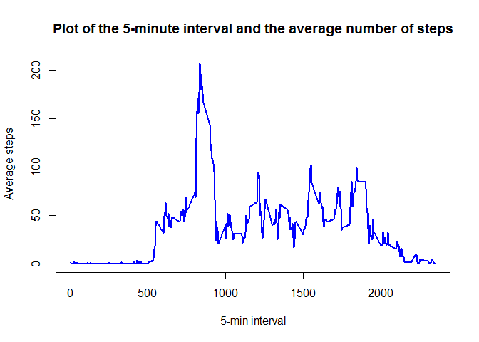

# Reproducible Research: Peer Assessment 1


## 1. Loading and preprocessing the data

```r
library(dplyr)
```

```r
activity <- read.csv("activity.csv", header = T)
activity$date <- as.Date(activity$date)
activity1 <- filter(activity, steps != 'NA')
```

## 2. What is mean total number of steps taken per day?

The data frame 'activity1' is now grouped by date using the expression `activity1 <- group_by(activity1, date)`
and a new object 's' is defined by summarising as `s <- summarise(activity1, Total.steps = sum(steps))`

###2a. The total number of steps taken per day (first few items) is as following:

```
## # A tibble: 6 × 2
##         date Total.steps
##       <date>       <int>
## 1 2012-10-02         126
## 2 2012-10-03       11352
## 3 2012-10-04       12116
## 4 2012-10-05       13294
## 5 2012-10-06       15420
## 6 2012-10-07       11015
```
###2b. The histogram of the total number of steps taken each day
The histogram is formed with the following code. The mean and median is shown by yellow and red lines respectively on the histogram using the 'abline' code

```r
hist(s$Total.steps, col = "purple", main = "Histogram for total daily steps", xlab = "Total Steps")
abline(v = c(mean(s$Total.steps),median(s$Total.steps)), col = c("yellow","red"), lwd=c(4,1))
```

<!-- -->

###2c. The mean and median of the total number of steps taken per day
The mean total number of steps per day = `round(mean(s$Total.steps))`= 10766 steps.

Similarly, The median total number of steps per day = `round(median(s$Total.steps))`= 10765 steps.

This is evident both from the histogram and from the calculation that the mean and median almost coincide in this case after ignoring the missing values.

## 3. What is the average daily activity pattern?
###3a. Time series plot of the 5-minute interval and the average number of steps taken, averaged across all days
The following code determines the average number of steps taken:

```r
t <- tapply(activity1$steps, activity1$interval, mean)
```
The plot is therefore run by the following code:

```r
plot(names(t),t, type = "l", col = "blue", lwd = 2, xlab = "5-min interval", ylab = "Average steps", main = "Plot of the 5-minute interval and the average number of steps")
```

<!-- -->

###3b. Interval with maximum number of steps
The interval can be determines using the code `names(t)[t == max(t)]` which yields to 835.


## 4. Imputing missing values
###4a. Number of rows with missing value
This can be calculated with the code `sum(is.na(activity$steps) == 'TRUE')` and the result is  2304.

###4b. Strategy for filling the missing values
The strategy remains very much straightforward. we replace the 'NA' values with the median of all the steps corresponding to a particular interval for all the days.

The code for sub-heading 3a produces a summary table listing the mean values of steps corresponding to each interval. First few values are 

```r
head(t)
```

```
##         0         5        10        15        20        25 
## 1.7169811 0.3396226 0.1320755 0.1509434 0.0754717 2.0943396
```
Now, the following code replaces all the 'NA' values of the data frame 'activity' with values of mean no. of steps in 't'.


```r
for (i in 1:dim(activity)[1])  {
       if (is.na(activity[i,]$steps) == 'TRUE') {activity[i,]$steps <-  t[names(t)==activity[i,]$interval]}
}
```
###4c. New dataset with all missing value replaced

```r
head(activity)
```

```
##       steps       date interval
## 1 1.7169811 2012-10-01        0
## 2 0.3396226 2012-10-01        5
## 3 0.1320755 2012-10-01       10
## 4 0.1509434 2012-10-01       15
## 5 0.0754717 2012-10-01       20
## 6 2.0943396 2012-10-01       25
```
###4d. The histogram after removal of missing values

```r
activity <- group_by(activity, date)
s1 <- summarise(activity, Total.steps = sum(steps))
hist(s1$Total.steps, col = "orange", main = "Histogram for total daily steps", xlab = "Total Steps")
abline(v = c(mean(s1$Total.steps),median(s1$Total.steps)), col = c("yellow","red"), lwd=c(4,1))
```

<!-- -->

The mean total number of steps per day = `round(mean(s1$Total.steps))`= 10766 steps.

Similarly, The median total number of steps per day = `round(median(s1$Total.steps))`= 10766 steps.

Therefore it is evident that there is not much effect of the missinng values in the mean and median.

## 5. Are there differences in activity patterns between weekdays and weekends?
###5a. Creating a new factor variable in the dataset with two levels - "weekday" and "weekend"
first with `activity <- mutate(activity, day.type = weekdays(date))` we add a column 'day.type'which shows the day corresponding to the date.


```
## Source: local data frame [6 x 4]
## Groups: date [1]
## 
##       steps       date interval day.type
##       <dbl>     <date>    <int>    <chr>
## 1 1.7169811 2012-10-01        0   Monday
## 2 0.3396226 2012-10-01        5   Monday
## 3 0.1320755 2012-10-01       10   Monday
## 4 0.1509434 2012-10-01       15   Monday
## 5 0.0754717 2012-10-01       20   Monday
## 6 2.0943396 2012-10-01       25   Monday
```

Next, with the follwoing code, we classify all weekdays and weekends and replace contents of column 'day.type' with weekdays and weekend only


```r
activity$day.type <- ifelse(activity$day.type == "Saturday"|activity$day.type =="Sunday", "Weekend", activity$day.type)
activity$day.type <- ifelse(activity$day.type != "Weekend", "weekdays",activity$day.type)
head(activity)
```

```
## Source: local data frame [6 x 4]
## Groups: date [1]
## 
##       steps       date interval day.type
##       <dbl>     <date>    <int>    <chr>
## 1 1.7169811 2012-10-01        0 weekdays
## 2 0.3396226 2012-10-01        5 weekdays
## 3 0.1320755 2012-10-01       10 weekdays
## 4 0.1509434 2012-10-01       15 weekdays
## 5 0.0754717 2012-10-01       20 weekdays
## 6 2.0943396 2012-10-01       25 weekdays
```

###5b. Panel plot for avg. no. of steps for weekdays and weekends
First we have summarised the data using the following code


```r
activity <- group_by(activity, interval, day.type)
s2 <- summarise(activity, Mean.steps = mean(steps))
```
The plot is generated through lattice with the following code


```r
library(lattice)
with(s2, xyplot(Mean.steps~interval|day.type, type=c("l","r"), layout=c(1,2), xlab = "Interval", ylab = "Average No. of Steps", main = "Panel plot for avg. no. of steps for weekdays and weekends"))
```

<!-- -->

From the graph, it appears that the No. of steps has a higher trend in weekends than in weekdays.
